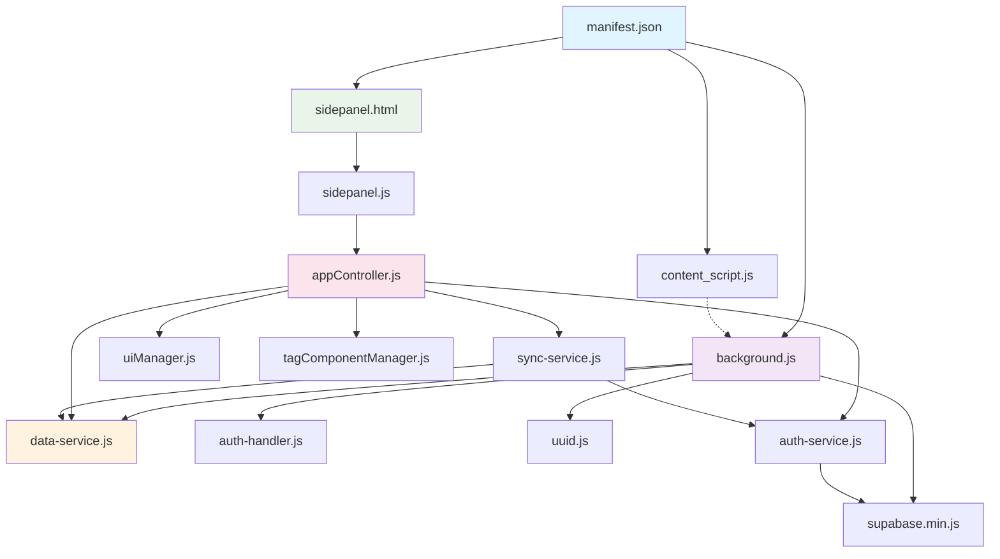

<div align="center">

# 🚀 PromptCraft

**智能提示词管理助手 | AI Prompt Management Extension**

[](https://microsoftedge.microsoft.com/addons/detail/prompt%E7%AE%A1%E7%90%86%E5%8A%A9%E6%89%8B/lfapnogloifoloicnbhajjphcgonefgm)
[](https://developer.chrome.com/docs/extensions/mv3/)
[](https://opensource.org/licenses/MIT)
[](https://developer.mozilla.org/en-US/docs/Web/JavaScript)
[](https://supabase.com)

*让 AI 提示词管理变得简单高效！*

[📥 立即安装](#-安装使用) • [🎯 功能特性](#-核心功能) • [📖 使用指南](#-快速上手) • [🛠️ 开发文档](#-技术栈)

</div>

---

## 📖 目录

- [✨ 项目简介](#-项目简介)
- [🎯 核心功能](#-核心功能)
- [🚀 安装使用](#-安装使用)
- [⚡ 快速上手](#-快速上手)
- [📁 项目结构](#-项目结构)
- [💻 技术栈](#-技术栈)
- [📝 更新日志](#-更新日志)
- [🤝 参与贡献](#-参与贡献)
- [📜 开源许可](#-开源许可)

---

## ✨ 项目简介

**PromptCraft** 是一款专为 AI 时代设计的智能提示词管理浏览器扩展。它帮助用户高效管理、快速调用各种 AI 提示词，支持云端同步，让您的 AI 工作流程更加流畅。

### 🌟 为什么选择 PromptCraft？

- **🚀 极速体验**: 骨架屏加载，"秒开"体验，告别白屏等待。
- **🔄 云端同步**: 支持 Google 登录，跨设备数据同步。
- **🎯 智能插入**: 支持 React、Vue、Angular 等现代框架的页面内快速调用。
- **🎨 现代设计**: 明暗双主题，响应式界面设计。
- **🔒 隐私安全**: 本地优先存储，符合最新安全标准。
- **⚡ 零依赖**: 纯原生技术栈，轻量高效。

---

## 🎯 核心功能

### 📝 **智能提示词管理**
- **📋 完整CRUD**: 创建、编辑、删除、搜索提示词。
- **🏷️ 标签系统**: 支持多标签分类，灵活组织您的提示词。
- **🔍 全文搜索**: 毫秒级响应，支持标题、内容、标签和作者的模糊匹配。
- **📊 字符统计**: 实时显示字符数，支持最多20000字符。
- **⏰ 智能排序**: 新创建提示词自动置顶，按时间排序。

### ⚡ **快速调用系统**
- **🎯 页面内调用**: 在任意输入框输入 "pp" 唤起选择器。
- **📋 一键复制**: 点击复制按钮快速获取提示词内容。
- **🖱️ 右键菜单**: 选中文本右键快速添加到提示词库。
- **⌨️ 快捷键支持**: `Ctrl+Shift+Z` / `Cmd+Shift+Z` 快速打开侧边栏。
- **🌐 跨框架兼容**: 支持现代Web应用的精准文本插入。

### 🔄 **云端同步机制**
- **🔐 安全认证**: Google OAuth 2.0 + Supabase 企业级后端。
- **⚡ 混合同步**: 本地操作立即推送云端，云端变更定时同步。
- **🔄 实时更新**: 登录/登出时触发同步，并支持手动同步。
- **🛡️ 数据安全**: RLS 行级安全策略，确保数据隔离。
- **📱 跨设备**: 多设备间数据自动同步，无缝切换。

### 🎨 **用户体验优化**
- **🌓 主题系统**: 自动/明亮/暗黑三种主题，可跟随系统设置。
- **📱 响应式设计**: 完美适配各种屏幕尺寸。
- **🎭 骨架屏加载**: 消除白屏等待，提供"秒开"体验。
- **✨ 流畅动画**: CSS3 过渡动画和悬停效果。
- **🔔 智能提示**: Toast 通知系统，操作反馈及时。

### 📊 **数据管理**
- **📤 导入导出**: 标准 JSON 格式，支持数据备份迁移。
- **🔍 格式验证**: 内置数据完整性检查，确保导入质量。
- **📋 模板下载**: 提供标准数据结构模板和示例。
- **🗂️ 批量操作**: 支持批量导入，智能处理重复项（同名覆盖）。

---

## 🚀 安装使用

### 📦 安装方式

#### 方式一：从商店安装（推荐）

- **Microsoft Edge**: [点击安装 Prompt管理助手](https://microsoftedge.microsoft.com/addons/detail/prompt%E7%AE%A1%E7%90%86%E5%8A%A9%E6%89%8B/lfapnogloifoloicnbhajjphcgonefgm)
  - 点击 "获取" 完成安装。

#### 方式二：开发者模式安装

```markdown
# 1. 克隆项目
git clone [https://github.com/Wangshixiong/PromptCraft.git](https://github.com/Wangshixiong/PromptCraft.git)
cd PromptCraft

# 2. 在 Edge/Chrome 中加载扩展
# 访问 edge://extensions/ 或 chrome://extensions/
# 开启"开发者模式"
# 点击"加载已解压的扩展程序"
# 选择项目根目录
### ✅ 安装验证

安装成功后，您将看到：
- Chrome 工具栏中出现 PromptCraft 图标
- 点击图标可打开侧边栏
- 按 `Ctrl+Shift+Z` (Mac: `Cmd+Shift+Z`) 快速打开

---

## ⚡ 快速上手

### 🎯 基础操作

1. **打开扩展**
   - 点击 Chrome 工具栏中的扩展图标
   - 或按快捷键 `Ctrl+Shift+Z` (Mac: `Cmd+Shift+Z`)

2. **添加提示词**
点击 "+ 添加提示词" → 填写标题和内容 → 选择分类 → 保存
3. **快速搜索**
在搜索框输入关键词 → 实时显示匹配结果
4. **使用提示词**
   - **复制使用**: 点击复制按钮，粘贴到目标位置
   - **快速插入**: 在输入框输入 "pp" 唤起选择器
   - **右键添加**: 选中文本右键选择"添加到提示词"

### 🔄 云端同步设置

1. **登录账户**
点击设置图标 → 点击"Google登录" → 完成授权

2. **同步机制**
   - **自动同步**: 本地操作立即推送到云端
   - **定时同步**: 每10分钟自动检查云端更新
   - **手动同步**: 点击同步按钮立即同步

### 📊 数据管理

1. **导出数据**
 设置 → 数据管理 → 导出数据 → 下载 JSON 文件
2. **导入数据**
   设置 → 数据管理 → 导入数据 → 选择 JSON 文件
```


### 💡 使用技巧

- **分类管理**: 使用有意义的分类名称，如"编程助手"、"文案创作"
- **搜索优化**: 在标题中包含关键词，提高搜索效率
- **内容组织**: 将相关提示词归类，便于管理和查找
- **定期备份**: 重要数据建议定期导出备份

---

## 📁 项目结构

### 🏗️ 整体架构

PromptCraft 采用现代化的分层架构设计，确保代码的可维护性和扩展性：
PromptCraft/
├── 📄 manifest.json             # Chrome扩展配置文件 (Manifest V3)
├── 📄 package.json              # 项目依赖配置（当前无第三方依赖）
├── 📄 readme.md                 # 项目说明文档
├── 📄 server.js                 # 本地开发服务器
└── 📁 src/                      # 源代码目录
    ├── 🔧 background.js         # 后台服务脚本 (Service Worker)
    ├── 🌐 content_script.js     # 内容脚本 (页面注入)
    ├── 📁 libs/                 # 第三方库
    │   └── supabase.min.js      # Supabase客户端库（本地文件）
    ├── 📁 utils/                # 工具函数目录
    │   ├── auth-handler.js      # 认证处理器
    │   ├── auth-service.js      # 认证服务
    │   ├── data-service.js      # 数据服务
    │   ├── json-utils.js        # JSON处理工具
    │   ├── sync-service.js      # 云端同步服务
    │   └── uuid.js              # UUID生成工具
    └── 📁 sidepanel/            # 侧边栏界面目录
        ├── sidepanel.html       # 主界面HTML
        ├── sidepanel.js         # 启动器脚本
        ├── appController.js     # 应用控制器 (业务逻辑)
        ├── uiManager.js         # UI管理器 (界面更新)
        ├── tagComponentManager.js # 标签组件管理器（原生JS实现）
        ├── 📁 components/       # 组件目录（包含未使用的Svelte组件）
        │   └── SmartTagInput.svelte # 智能标签输入组件（未实际使用）
        └── 📁 css/               # 样式文件目录
            ├── base.css
            ├── components.css
            ├── layout.css
            └── main.css

### 📋 文件功能说明

#### 🔧 核心配置文件
| 文件              | 主要作用                                                 | 技术栈       |
| ----------------- | -------------------------------------------------------- | ------------ |
| **manifest.json** | 扩展元数据配置，定义权限、图标、侧边面板路径、后台脚本等 | Manifest V3  |
| **package.json**  | 项目依赖管理，定义脚本命令和项目信息                     | Node.js      |
| **server.js**     | 本地开发HTTP服务器，提供静态文件服务                     | Node.js HTTP |

#### 🔧 后台服务层
| 文件                  | 主要作用                                                     | 调用关系                                                     |
| --------------------- | ------------------------------------------------------------ | ------------------------------------------------------------ |
| **background.js**     | 扩展生命周期管理，监听安装/启动事件，处理右键菜单，加载默认数据 | 导入并调用 `data-service.js`、`auth-handler.js`、`uuid.js`、`supabase.min.js` |
| **content_script.js** | 页面内容注入，实现"pp"快速调用功能，注入CSS样式和UI组件      | 接收来自 `background.js` 的消息                              |

#### 🛠️ 工具服务层
| 文件                | 主要作用                                                     | 调用关系                                                     |
| ------------------- | ------------------------------------------------------------ | ------------------------------------------------------------ |
| **data-service.js** | 统一数据访问接口，管理Chrome Storage，提供CRUD操作和数据验证 | 被 `background.js`、`appController.js`、`sync-service.js` 调用 |
| **auth-service.js** | Supabase认证服务，管理用户登录状态，处理Google OAuth认证     | 被 `appController.js`、`sync-service.js` 调用                |
| **auth-handler.js** | 认证处理器，处理认证状态恢复和管理                           | 被 `background.js` 调用                                      |
| **sync-service.js** | 云端数据同步，实现本地与Supabase的双向同步，冲突解决         | 调用 `auth-service.js`、`data-service.js`，被 `appController.js` 调用 |
| **json-utils.js**   | JSON数据处理工具，提供数据验证和格式化功能                   | 被数据导入导出功能调用                                       |
| **uuid.js**         | UUID生成工具，为数据记录提供唯一标识符                       | 被 `background.js`、`data-service.js` 调用                   |

#### 🎨 前端界面层
| 文件                       | 主要作用                                               | 调用关系                                                     |
| -------------------------- | ------------------------------------------------------ | ------------------------------------------------------------ |
| **sidepanel.html**         | 侧边栏UI结构，定义主视图、表单视图、设置弹窗等界面元素 | 加载 `sidepanel.js` 作为入口                                 |
| **sidepanel.js**           | 应用启动器，初始化全局状态，委托业务逻辑给控制器       | 调用 `appController.js` 进行初始化                           |
| **appController.js**       | 应用控制器，处理所有业务逻辑，连接UI事件和后台服务     | 调用 `uiManager.js`、`data-service.js`、`auth-service.js`、`sync-service.js` |
| **uiManager.js**           | UI管理器，负责所有DOM操作，视图切换，界面渲染和更新    | 被 `appController.js` 调用                                   |
| **tagComponentManager.js** | 标签组件管理器，处理标签相关的UI逻辑和交互             | 被 `appController.js` 调用                                   |

#### 🎨 样式文件
| 文件               | 主要作用                        |
| ------------------ | ------------------------------- |
| **base.css**       | 基础样式，CSS变量定义，主题系统 |
| **components.css** | 组件样式，按钮、输入框、卡片等  |
| **layout.css**     | 布局样式，网格系统，响应式设计  |
| **main.css**       | 主样式文件，整合所有样式        |

#### 📚 第三方库
| 文件                | 主要作用                                                     |
| ------------------- | ------------------------------------------------------------ |
| **supabase.min.js** | Supabase客户端库，提供认证和数据库服务（本地文件）           |
| **Font Awesome**    | 图标库（CDN引入：https://cdnjs.cloudflare.com/ajax/libs/font-awesome/6.4.0/css/all.min.css） |

### 🔄 核心调用关系图



**数据流向说明**：
1. **配置层**: `manifest.json` 定义扩展结构和权限
2. **后台层**: `background.js` 管理扩展生命周期，处理系统事件
3. **界面层**: `sidepanel.html` → `sidepanel.js` → `appController.js` 形成UI控制链
4. **服务层**: 各种service提供专业化功能支持
5. **存储层**: `data-service.js` 统一管理所有数据访问
6. **同步层**: `sync-service.js` 实现云端数据同步
7. **注入层**: `content_script.js` 实现页面内快速调用功能
        ├── tagComponentManager.js # 标签组件管理器（原生JS实现）
        ├── 📁 components/       # 组件目录（包含未使用的Svelte组件）
        │   └── SmartTagInput.svelte # 智能标签输入组件（未实际使用）
        └── 📁 css/               # 样式文件目录
            ├── base.css
            ├── components.css
            ├── layout.css
            └── main.css
### 🔧 核心架构

- **前端界面**: 原生JavaScript + CSS3，轻量高效
- **数据存储**: Chrome Storage API + Supabase云端同步
- **认证系统**: Google OAuth 2.0 + Supabase Auth
- **扩展标准**: Manifest V3，符合最新安全规范

---

## 💻 技术栈

### 🎯 核心技术

| 技术领域     | 技术选型             | 版本   | 说明                             |
| ------------ | -------------------- | ------ | -------------------------------- |
| **前端框架** | 原生 JavaScript      | ES6+   | 零第三方框架依赖，确保轻量和安全 |
| **认证系统** | Google OAuth 2.0     | -      | Chrome Identity API 集成         |
| **云端服务** | Supabase             | Latest | PostgreSQL + Auth + RLS          |
| **样式系统** | CSS3 + CSS Variables | -      | 动态主题切换和响应式设计         |
| **存储引擎** | Chrome Storage API   | -      | 本地存储 + 云端同步架构          |
| **扩展标准** | Manifest V3          | 3.0    | 符合最新安全规范                 |
| **图标系统** | Font Awesome         | 6.4.0  | CDN引入，矢量化设计              |

### 🏗️ 架构特性

#### 🔐 **安全认证架构**
- **OAuth 2.0 集成**: Chrome Identity API 实现 Google 登录
- **会话管理**: Supabase Auth 提供安全的会话状态管理
- **状态监听**: 实时监听认证状态变化，自动更新UI
- **安全令牌**: JWT令牌自动刷新，确保会话持续有效

#### 📊 **数据管理架构**
- **混合存储模式**: Chrome Storage API (本地) + Supabase (云端)
- **单一数据源**: 通过 `DataService` 类统一管理所有存储操作
- **异步数据流**: 全面采用 async/await 模式
- **数据完整性**: JSON Schema 验证、错误恢复、版本兼容

#### ⚡ **性能优化策略**
- **骨架屏技术**: 首次加载显示占位符，消除白屏等待
- **异步初始化**: 数据加载与UI渲染并行处理
- **事件防抖**: 搜索输入采用300ms防抖，减少计算开销
- **DOM批量更新**: DocumentFragment 批量操作，减少重排重绘

#### 🌐 **跨平台兼容技术**
- **框架无关设计**: 原生DOM API兼容React、Vue、Angular
- **智能事件处理**: 支持原生事件和框架合成事件
- **目标元素锁定**: 智能识别各种输入组件
- **样式隔离**: 确保扩展样式不影响宿主页面

### 🛡️ **安全与隐私**

- **🔒 本地优先**: 所有功能优先考虑本地实现
- **🛡️ 权限最小化**: 仅申请必要的Chrome API权限
- **🔐 数据加密**: 敏感数据本地加密存储
- **📋 隐私合规**: 符合GDPR和国内数据保护法规
- **🔍 代码审计**: 完整源代码开放，可自由审计

---

## 📝 更新日志

### v1.3.5 (2024-12-28)
- 🎨 UI重构：现代化设计，优化布局和交互动画
- 🔍 搜索功能优化：圆润边角设计，提升用户体验
- 🏷️ 标签系统改进：pill形状设计，横向滚动布局

### v1.3.1 (2025-06-30)
- 🐛 修复手动同步失败Bug
- 📊 增强错误诊断和日志记录
- 🔍 新增会话状态检查和网络连接验证

### v1.3.0 (2025-06-30)
- 🔧 JavaScript代码模块化重构
- 📁 优化文件结构和分层架构
- ⚡ 提升应用响应速度和代码质量

### v1.2.2 (2025-06-27)
- 🛡️ 修复Google登录退出后数据丢失问题
- 🔧 修复浏览器重启后错误触发首次安装流程
- 🌐 修复页面兼容性问题

### v1.2.1 (2025-06-25)
- 🔧 修复Google登录状态持久化问题
- 🎯 优化认证状态同步机制
- ✨ 改进登录取消体验

### v1.2.0 (2025-06-22)
- 🎭 优化登录动画和进度反馈
- ⚡ 解决首次登录10秒延迟问题
- 🛡️ 增强登录流程稳定性

### v1.1.0 (2025-06-22)
- 🚀 实现消息驱动架构重构
- 🔧 服务单例化，解决多实例干扰
- ⚡ 优化UI刷新性能

### v1.0.0 (2025-06-20)
- 🔄 实现完整的云端同步功能
- 🔀 混合同步机制：本地立即推送，云端定时同步
- 📱 支持跨设备数据一致性

### v0.9.0 (2025-06-19)
- 🔐 新增Google OAuth登录功能
- 🛡️ 优化安全性和代码结构
- ⚡ 性能优化和架构改进

### v0.5.1 (2025-06-17)
- 📋 提示词排序优化：新创建自动置顶
- 🎨 主题选择器重设计
- 🎯 文本插入逻辑优化

### v0.5.0 (2025-06-16)
- 🚀 重大架构重构，简化扩展结构
- 🔒 本地存储增强，隐私保护升级
- ⚡ 启动性能优化，减少外部依赖

### v0.1.9 (2025-06-14)
- 🚀 实现骨架屏加载，解决白屏问题
- ⚡ "秒开"体验优化
- 🎭 平滑脉冲动画，支持主题切换

### v0.1.7 (2025-06-14)
- 🚀 跨框架文本插入优化
- 🎯 目标元素锁定增强
- 🌐 跨iframe支持完善

### v0.1.6 (2025-06-13)
- ⚡ 初始化架构优化
- 📋 默认提示词预加载
- 🛡️ 错误处理改进

### v0.1.5
- 📝 内容长度限制（10000字符）
- 📊 实时字符计数功能
- 🎨 预览高度优化

### v0.1.3 (2025-06-12)
- 🖱️ 右键菜单功能
- 🔍 搜索性能优化
- 🏷️ 分类管理改进

### v0.1.2 (2025-06-11)
- 📁 JSON导入导出功能
- 🎨 卡片显示优化

### v0.1.1 (2025-06-10)
- 🏷️ 分类管理功能
- 🔍 搜索算法优化

### v0.1.0 (2025-06-09)
- 🎉 首次发布
- 💾 本地存储支持
- 🎨 现代化界面设计

---

## 🤝 参与贡献

欢迎提交Bug报告、功能建议或代码贡献！

### 开发环境
1. 克隆项目到本地
2. 在Chrome中加载扩展（开发者模式）
3. 修改代码后重新加载扩展测试

### 提交规范
- `feat`: 新功能
- `fix`: Bug修复  
- `docs`: 文档更新
- `style`: 样式调整

---

## 📜 开源许可

本项目采用 **MIT License** 开源协议

MIT License

Copyright (c) 2024 PromptCraft

Permission is hereby granted, free of charge, to any person obtaining a copy
of this software and associated documentation files (the "Software"), to deal
in the Software without restriction, including without limitation the rights
to use, copy, modify, merge, publish, distribute, sublicense, and/or sell
copies of the Software, and to permit persons to whom the Software is
furnished to do so, subject to the following conditions:

The above copyright notice and this permission notice shall be included in all
copies or substantial portions of the Software.

THE SOFTWARE IS PROVIDED "AS IS", WITHOUT WARRANTY OF ANY KIND, EXPRESS OR
IMPLIED, INCLUDING BUT NOT LIMITED TO THE WARRANTIES OF MERCHANTABILITY,
FITNESS FOR A PARTICULAR PURPOSE AND NONINFRINGEMENT. IN NO EVENT SHALL THE
AUTHORS OR COPYRIGHT HOLDERS BE LIABLE FOR ANY CLAIM, DAMAGES OR OTHER
LIABILITY, WHETHER IN AN ACTION OF CONTRACT, TORT OR OTHERWISE, ARISING FROM,
OUT OF OR IN CONNECTION WITH THE SOFTWARE OR THE USE OR OTHER DEALINGS IN THE
SOFTWARE.
```

---

<div align="center">

### 🌟 如果这个项目对您有帮助，请给我们一个Star！

### 💬 有问题或建议？欢迎提交Issue或Pull Request

### 📧 联系我们: [wenhua0205@163.com](mailto:wenhua0205@163.com)

---

**PromptCraft** - 让 AI 提示词管理变得简单高效！

*Built with ❤️ by the PromptCraft Team*

</div>
```