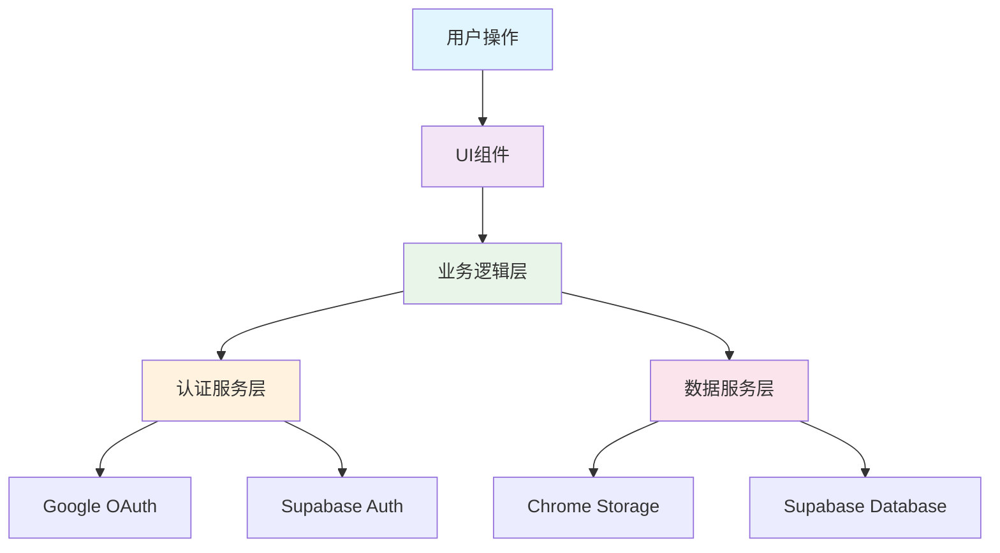

<div align="center">

# 🚀 PromptCraft

**智能提示词管理助手 | AI Prompt Management Extension**

[](https://chrome.google.com/webstore)
[](https://developer.chrome.com/docs/extensions/mv3/)
[](https://opensource.org/licenses/MIT)
[](https://developer.mozilla.org/en-US/docs/Web/JavaScript)
[](https://supabase.com)

*让 AI 提示词管理变得简单高效！*

[📥 立即安装](#-安装使用) • [🎯 功能特性](#-核心功能) • [📖 使用指南](#-快速上手) • [🛠️ 开发文档](#-技术栈)

</div>

---

## 📖 目录

- [✨ 项目简介](#-项目简介)
- [🎯 核心功能](#-核心功能)
- [🚀 安装使用](#-安装使用)
- [⚡ 快速上手](#-快速上手)
- [📁 项目结构](#-项目结构)
- [💻 技术栈](#-技术栈)
- [📝 更新日志](#-更新日志)
- [🤝 参与贡献](#-参与贡献)
- [📜 开源许可](#-开源许可)

---

## ✨ 项目简介

**PromptCraft** 是一款专为 AI 时代设计的智能提示词管理 Chrome 扩展。它帮助用户高效管理、快速调用各种 AI 提示词，支持云端同步，让您的 AI 工作流程更加流畅。

### 🌟 为什么选择 PromptCraft？

- **🚀 极速体验**: 骨架屏加载，"秒开"体验，告别白屏等待
- **🔄 云端同步**: 支持 Google 登录，跨设备数据同步
- **🎯 智能插入**: 支持 React、Vue、Angular 等现代框架
- **🎨 现代设计**: 明暗双主题，响应式界面设计
- **🔒 隐私安全**: 本地优先存储，符合最新安全标准
- **⚡ 零依赖**: 纯原生技术栈，轻量高效

---

## 🎯 核心功能

### 📝 **智能提示词管理**
- **📋 完整CRUD**: 创建、编辑、删除、搜索提示词
- **🏷️ 分类管理**: 支持自定义分类，预设AI绘画、编程助手等
- **🔍 全文搜索**: 毫秒级响应，支持标题和内容模糊匹配
- **📊 字符统计**: 实时显示字符数，支持最多10000字符
- **⏰ 智能排序**: 新创建提示词自动置顶，按时间排序

### ⚡ **快速调用系统**
- **🎯 页面内调用**: 任意输入框输入 "pp" 唤起选择器
- **📋 一键复制**: 点击复制按钮快速获取提示词内容
- **🖱️ 右键菜单**: 选中文本右键快速添加到提示词库
- **⌨️ 快捷键支持**: `Ctrl+B` / `Cmd+B` 快速打开侧边栏
- **🌐 跨框架兼容**: 支持现代Web应用的精准文本插入

### 🔄 **云端同步机制**
- **🔐 安全认证**: Google OAuth 2.0 + Supabase 企业级后端
- **⚡ 混合同步**: 本地操作立即推送，云端变更定时同步
- **🔄 实时更新**: 登录/登出时触发同步，手动同步支持
- **🛡️ 数据安全**: RLS 行级安全策略，确保数据隔离
- **📱 跨设备**: 多设备间数据自动同步，无缝切换

### 🎨 **用户体验优化**
- **🌓 主题系统**: 自动/明亮/暗黑三种主题，跟随系统设置
- **📱 响应式设计**: 完美适配各种屏幕尺寸
- **🎭 骨架屏加载**: 消除白屏等待，提供"秒开"体验
- **✨ 流畅动画**: CSS3 过渡动画和悬停效果
- **🔔 智能提示**: Toast 通知系统，操作反馈及时

### 📊 **数据管理**
- **📤 导入导出**: 标准 JSON 格式，支持数据备份迁移
- **🔍 格式验证**: 内置数据完整性检查，确保导入质量
- **📋 模板下载**: 提供标准数据结构模板和示例
- **🗂️ 批量操作**: 支持批量导入，智能处理重复项

---

## 🚀 安装使用

### 📦 安装方式

#### 方式一：开发者模式安装（推荐）

```bash
# 1. 克隆项目
git clone https://github.com/Wangshixiong/PromptCraft.git
cd PromptCraft

# 2. 在 Chrome 中加载扩展
# 访问 chrome://extensions/
# 开启"开发者模式"
# 点击"加载已解压的扩展程序"
# 选择项目根目录
```

#### 方式二：Chrome Web Store（即将上线）
- 搜索 "PromptCraft" 或 "提示词管理助手"
- 点击"添加至Chrome"完成安装

### ✅ 安装验证

安装成功后，您将看到：
- Chrome 工具栏中出现 PromptCraft 图标
- 点击图标可打开侧边栏
- 按 `Ctrl+B` (Mac: `Cmd+B`) 快速打开

---

## ⚡ 快速上手

### 🎯 基础操作

1. **打开扩展**
   - 点击 Chrome 工具栏中的扩展图标
   - 或按快捷键 `Ctrl+B` (Mac: `Cmd+B`)

2. **添加提示词**
   ```
   点击 "+ 添加提示词" → 填写标题和内容 → 选择分类 → 保存
   ```

3. **快速搜索**
   ```
   在搜索框输入关键词 → 实时显示匹配结果
   ```

4. **使用提示词**
   - **复制使用**: 点击复制按钮，粘贴到目标位置
   - **快速插入**: 在输入框输入 "pp" 唤起选择器
   - **右键添加**: 选中文本右键选择"添加到提示词"

### 🔄 云端同步设置

1. **登录账户**
   ```
   点击设置图标 → 点击"Google登录" → 完成授权
   ```

2. **同步机制**
   - **自动同步**: 本地操作立即推送到云端
   - **定时同步**: 每10分钟自动检查云端更新
   - **手动同步**: 点击同步按钮立即同步

### 📊 数据管理

1. **导出数据**
   ```
   设置 → 数据管理 → 导出数据 → 下载 JSON 文件
   ```

2. **导入数据**
   ```
   设置 → 数据管理 → 导入数据 → 选择 JSON 文件
   ```

### 💡 使用技巧

- **分类管理**: 使用有意义的分类名称，如"编程助手"、"文案创作"
- **搜索优化**: 在标题中包含关键词，提高搜索效率
- **内容组织**: 将相关提示词归类，便于管理和查找
- **定期备份**: 重要数据建议定期导出备份

---

## 📁 项目结构

### 🏗️ 整体架构

PromptCraft 采用现代化的分层架构设计，确保代码的可维护性和扩展性：

```
PromptCraft/
├── 📄 manifest.json             # Chrome扩展配置文件 (Manifest V3)
├── 📦 package.json              # 项目依赖配置 (纯原生，无外部依赖)
├── 📖 README.md                 # 项目说明文档
├── 📁 .trae/                    # Trae AI 配置目录
│   └── rules/
│       └── project_rules.md     # 项目开发规范
├── 📁 docs/                     # 文档目录
│   ├── TODO.md                  # 开发任务和规范
│   ├── 云同步需求说明书.md       # 云同步功能需求文档
│   └── *.md                     # 任务规划文档
├── 📁 assets/                   # 静态资源目录
│   ├── icons/                   # 图标文件目录
│   │   ├── icon16.png           # 16x16 主图标
│   │   ├── icon32.png           # 32x32 图标
│   │   ├── icon48.png           # 48x48 图标
│   │   ├── icon128.png          # 128x128 高分辨率图标
│   │   ├── Settings.svg         # 设置图标 (SVG矢量)
│   │   └── User.svg             # 用户图标 (SVG矢量)
│   └── data/                    # 数据文件目录
│       └── default-prompts.json # 默认提示词数据集
└── 📁 src/                      # 源代码目录
    ├── 🔧 background.js         # 后台服务脚本 (Service Worker)
    ├── 🌐 content_script.js     # 内容脚本 (页面注入)
    ├── 📁 utils/                # 工具函数目录 (核心模块)
    │   ├── auth-service.js      # 认证服务层 (OAuth & Supabase)
    │   ├── data-service.js      # 数据服务层 (单一数据源)
    │   ├── sync-service.js      # 云端同步服务
    │   ├── json-utils.js        # JSON处理工具
    │   └── uuid.js              # UUID生成工具
    └── 📁 sidepanel/            # 侧边栏界面目录
        ├── sidepanel.html       # 主界面HTML结构
        ├── sidepanel.css        # 样式文件 (支持明暗主题)
        ├── sidepanel.js         # 主要逻辑脚本
        └── styles/              # 样式模块目录
```

### 🔧 核心模块说明

| 模块 | 职责 | 技术栈 |
|------|------|--------|
| **🔐 认证服务层** | 用户认证和会话管理 | Chrome Identity API + Supabase Auth |
| **📊 数据服务层** | 统一数据访问接口 | Chrome Storage API + 单一数据源模式 |
| **🔄 同步服务层** | 云端数据同步逻辑 | Supabase Database + RLS 安全策略 |
| **🔧 后台服务** | 扩展生命周期管理 | Service Worker (Manifest V3) |
| **🌐 内容脚本** | 页面交互和文本插入 | DOM API + 跨框架兼容 |
| **🎨 用户界面** | 响应式界面组件 | 原生 HTML5 + CSS3 + ES6+ |

### 🔄 数据流架构



---

## 💻 技术栈

### 🎯 核心技术

| 技术领域 | 技术选型 | 版本 | 说明 |
|----------|----------|------|------|
| **前端框架** | 原生 JavaScript | ES6+ | 零外部依赖，确保轻量和安全 |
| **认证系统** | Google OAuth 2.0 | - | Chrome Identity API 集成 |
| **云端服务** | Supabase | Latest | PostgreSQL + Auth + RLS |
| **样式系统** | CSS3 + CSS Variables | - | 动态主题切换和响应式设计 |
| **存储引擎** | Chrome Storage API | - | 本地存储 + 云端同步架构 |
| **扩展标准** | Manifest V3 | 3.0 | 符合最新安全规范 |
| **图标系统** | Font Awesome + SVG | 6.4.0 | 矢量化设计 |

### 🏗️ 架构特性

#### 🔐 **安全认证架构**
- **OAuth 2.0 集成**: Chrome Identity API 实现 Google 登录
- **会话管理**: Supabase Auth 提供安全的会话状态管理
- **状态监听**: 实时监听认证状态变化，自动更新UI
- **安全令牌**: JWT令牌自动刷新，确保会话持续有效

#### 📊 **数据管理架构**
- **混合存储模式**: Chrome Storage API (本地) + Supabase (云端)
- **单一数据源**: 通过 `DataService` 类统一管理所有存储操作
- **异步数据流**: 全面采用 async/await 模式
- **数据完整性**: JSON Schema 验证、错误恢复、版本兼容

#### ⚡ **性能优化策略**
- **骨架屏技术**: 首次加载显示占位符，消除白屏等待
- **异步初始化**: 数据加载与UI渲染并行处理
- **事件防抖**: 搜索输入采用300ms防抖，减少计算开销
- **DOM批量更新**: DocumentFragment 批量操作，减少重排重绘

#### 🌐 **跨平台兼容技术**
- **框架无关设计**: 原生DOM API兼容React、Vue、Angular
- **智能事件处理**: 支持原生事件和框架合成事件
- **目标元素锁定**: 智能识别各种输入组件
- **样式隔离**: 确保扩展样式不影响宿主页面

### 🛡️ **安全与隐私**

- **🔒 本地优先**: 所有功能优先考虑本地实现
- **🛡️ 权限最小化**: 仅申请必要的Chrome API权限
- **🔐 数据加密**: 敏感数据本地加密存储
- **📋 隐私合规**: 符合GDPR和国内数据保护法规
- **🔍 代码审计**: 完整源代码开放，可自由审计

---

## 📝 更新日志

### v1.2.0 (2025-06-22)
- 🎭 **登录动画优化**: 实现流畅的登录按钮加载动画，提供清晰的视觉反馈
- 📊 **进度反馈系统**: 新增分阶段登录进度提示（"正在连接Google..."、"正在验证身份..."、"正在同步数据..."）
- ⚡ **预加载优化**: 启动时预热登录资源，显著减少首次登录等待时间，解决10秒延迟问题
- 🛡️ **智能状态管理**: 防重复点击保护，自动状态恢复，确保登录流程稳定可靠
- 🎯 **用户体验提升**: 完整的登录交互体验重构，从点击到完成全程可视化反馈
- 🔧 **架构优化**: 实现消息驱动的进度回调机制，前后端协同处理登录状态

### v1.1.0 (2025-06-22)
- 🚀 **消息驱动架构**: 实现全面的通信机制重构，所有核心服务由后台脚本统一管理
- 🔧 **服务单例化**: 确保核心服务单实例运行，解决多实例干扰问题
- 🎯 **模块化解耦**: 彻底分离UI渲染与业务逻辑，提升代码可维护性
- ⚡ **UI刷新优化**: 解决"通知风暴"导致的界面卡顿问题，提升列表更新性能
- 🛡️ **并发问题修复**: 彻底解决同步流程并发执行Bug，确保数据处理原子性
- 🔐 **认证流程修复**: 修复脚本上下文隔离导致的认证超时问题
- 🔄 **同步算法完善**: 优化云端删除记录处理逻辑，避免"僵尸记录"问题
- 🧹 **冗余调用清理**: 移除主题设置的重复轮询请求，减少资源消耗

### v1.0.0 (2025-06-20)
- 🔄 **云端同步功能**: 实现完整的Supabase云端数据同步，支持跨设备数据一致性
- 🔀 **混合同步机制**: 本地操作立即推送云端，云端变更通过定时同步（10分钟）和事件触发更新本地
- 🐛 **Toast通知修复**: 修复重复toast提示问题，移除重复的消息监听器
- 🔧 **云端删除同步**: 修复云端删除操作无法同步到本地的问题
- ⚡ **同步性能优化**: 优化同步状态管理，减少不必要的UI刷新
- 🛡️ **数据一致性**: 增强本地和云端数据的一致性保障机制
- 📱 **跨设备体验**: 完善多设备间的数据同步体验

### v0.9.0 (2025-06-19)
- 🔐 **用户认证系统**: 新增Google OAuth登录功能，支持安全的用户身份验证
- 🔧 **OAuth认证流程重构**: 完全重构OAuth认证系统，移除冲突代码，采用纯`chrome.identity.launchWebAuthFlow`实现
- 🛡️ **安全性增强**: 优化Supabase配置，简化消息传递机制，提升系统安全性
- 🧹 **代码清理优化**: 移除冗余代码和不必要的权限，精简manifest.json配置
- 🐛 **语法错误修复**: 解决`authService`标识符重复声明问题，确保代码正确运行
- ⚡ **性能优化**: 修复多个GoTrueClient实例警告，优化认证服务加载逻辑
- 🔄 **架构改进**: 简化认证服务初始化流程，添加防重复加载机制

### v0.5.1 (2025-06-17)
- 📋 **提示词排序优化**: 新创建的提示词自动显示在列表顶部，按创建时间降序排列（同步优化唤醒窗口提示词列表排序，共用一个排序规则）
- 🎨 **主题选择器重设计**: 重新设计外观设置布局，图标和文字同行显示，提升用户体验
- 🔧 **界面布局改进**: 优化设置面板中主题选择器的视觉效果和间距。数据管理布局。
- 🎯 **文本插入逻辑**: 确保快速调用功能的文本插入格式与复制按钮保持一致

### v0.5.0 (2025-06-16)
- 🚀 **重大架构重构**: 简化扩展整体架构，移除不必要的复杂性，提升系统性能和稳定性
- 🔒 **本地存储增强**: 优化Chrome Storage API使用机制，提升数据读写效率和安全性
- 🛡️ **隐私保护升级**: 强化用户数据隐私保护，确保所有数据仅在本地处理，无任何外部传输
- 🏗️ **界面流程简化**: 优化用户操作流程，移除不必要的认证步骤，提供更直接的使用体验
- ⚡ **启动性能优化**: 减少外部依赖库，显著提升扩展启动速度和响应性能
- 🧹 **代码质量提升**: 大规模代码重构和清理，移除冗余代码，提升代码可维护性
- 📝 **权限配置精简**: 优化manifest.json配置，移除不必要的权限申请，降低安全风险
- 🔧 **依赖管理优化**: 精简package.json依赖项，减少包体积，提升安装和更新速度

### v0.1.9 (2025-06-14)
- 🚀 **重大性能优化**: 实现骨架屏加载，彻底解决首次打开2-3秒白屏问题
- ⚡ **"秒开"体验**: 用户打开侧边栏时立即看到优雅的骨架屏占位符
- 🎨 **骨架屏设计**: 添加4个静态骨架卡片，包含标题、按钮、分类、内容行等完整占位符
- 🔄 **加载流程重构**: 移除setTimeout延迟，改为完全async/await实现
- 📊 **数据获取优化**: 先从chrome.storage.local获取数据，再进行渲染
- 🎭 **动画效果**: 骨架屏采用平滑脉冲动画，支持明暗主题切换
- 💾 **数据源统一**: 确保所有组件都使用chrome.storage.local作为唯一数据源

### v0.1.7 (2025-06-14)
- 🚀 **跨框架文本插入优化**: 提升与各种前端框架的兼容性
- 🎯 **目标元素锁定增强**: 确保文本插入的准确性和稳定性
- 🌐 **跨iframe支持完善**: 通过manifest.json配置实现全框架覆盖
- 🎨 **主题系统修复**: 恢复原生CSS媒体查询主题检测，确保主题一致性

### v0.1.6 (2025-06-13)
- ⚡ **初始化架构优化**: 提升数据加载性能和扩展启动速度
- 📋 **默认提示词预加载**: 扩展启动时自动加载到内存，提升响应速度
- 🛡️ **错误处理改进**: 新增用户友好的错误提示功能
- 🔧 **manifest配置完善**: 确保资源文件正确访问

### v0.1.5
- 📝 **内容长度限制**: 增加提示词内容10000字符限制
- 📊 **实时字符计数**: 新增字符计数显示功能
- 🎨 **预览高度优化**: 提示词卡片预览显示更多内容
- 📚 **默认提示词更新**: 新增多个高质量专业提示词

### v0.1.3 (2025-06-12)
- 🖱️ **右键菜单功能**: 新增右键快速添加提示词功能
- 🔍 **搜索性能优化**: 提升搜索功能响应速度
- 🏷️ **分类管理改进**: 优化分类管理界面体验

### v0.1.2 (2025-06-11)
- 📁 **JSON导入导出**: 新增JSON格式数据导入导出功能
- 🎨 **卡片显示优化**: 提升提示词卡片的视觉效果

### v0.1.1 (2025-06-10)
- 🏷️ **分类管理功能**: 新增提示词分类管理系统
- 🔍 **搜索算法优化**: 改进搜索性能和准确性

### v0.1.0 (2025-06-09)
- 🎉 **首次发布**: 基础的提示词管理功能
- 💾 **本地存储支持**: 纯本地数据存储，保护用户隐私
- 🎨 **简洁界面**: 现代化的用户界面设计

---

## 🤝 参与贡献

我们欢迎所有形式的贡献！无论是报告Bug、提出功能建议，还是提交代码改进。

### 🚀 开发环境搭建

```bash
# 1. Fork 并克隆项目
git clone https://github.com/YOUR_USERNAME/PromptCraft.git
cd PromptCraft

# 2. 在Chrome中加载扩展
# 打开 chrome://extensions/
# 开启"开发者模式"
# 点击"加载已解压的扩展程序"
# 选择项目根目录

# 3. 开发和测试
# 修改代码后，在扩展管理页面点击刷新按钮
```

### 📋 贡献指南

#### 🔧 代码规范
- **命名约定**: 使用驼峰命名法，函数和变量名要有意义
- **注释规范**: 关键函数必须有JSDoc注释
- **代码风格**: 遵循现有的代码风格和格式
- **ES6+语法**: 统一使用现代JavaScript语法

#### 🧪 测试要求
- **功能测试**: 确保新功能在不同场景下正常工作
- **兼容性测试**: 验证在不同网站和框架中的兼容性
- **回归测试**: 确保修改不影响现有功能
- **性能测试**: 关注性能影响，避免引入性能问题

#### 📝 提交规范

```bash
# 提交信息格式
<type>(<scope>): <description>

# 示例
feat(auth): 添加Google OAuth登录功能
fix(sync): 修复云端同步数据丢失问题
docs(readme): 更新安装说明文档
style(ui): 优化暗黑主题下的按钮样式
```

**提交类型说明**:
- `feat`: 新功能
- `fix`: Bug修复
- `docs`: 文档更新
- `style`: 样式修改
- `refactor`: 代码重构
- `test`: 测试相关
- `chore`: 构建过程或辅助工具的变动

### 🐛 问题反馈

#### 📋 Bug报告模板

```markdown
**Bug描述**
简洁明了地描述遇到的问题

**复现步骤**
1. 打开扩展
2. 点击...
3. 看到错误...

**预期行为**
描述您期望发生的情况

**实际行为**
描述实际发生的情况

**环境信息**
- Chrome版本: [例如 Chrome 120.0.6099.109]
- 操作系统: [例如 Windows 11, macOS 14.0]
- 扩展版本: [例如 v1.1.0]

**截图**
如果适用，添加截图来帮助解释您的问题
```

#### 💡 功能建议模板

```markdown
**功能描述**
简洁明了地描述您希望添加的功能

**使用场景**
描述这个功能的使用场景和价值

**解决方案**
描述您认为可行的实现方案

**替代方案**
描述您考虑过的其他解决方案
```

### 🏆 贡献者

感谢所有为 PromptCraft 做出贡献的开发者！

<!-- 这里可以添加贡献者列表 -->

---

## 📜 开源许可

本项目采用 **MIT License** 开源协议

```
MIT License

Copyright (c) 2024 PromptCraft

Permission is hereby granted, free of charge, to any person obtaining a copy
of this software and associated documentation files (the "Software"), to deal
in the Software without restriction, including without limitation the rights
to use, copy, modify, merge, publish, distribute, sublicense, and/or sell
copies of the Software, and to permit persons to whom the Software is
furnished to do so, subject to the following conditions:

The above copyright notice and this permission notice shall be included in all
copies or substantial portions of the Software.

THE SOFTWARE IS PROVIDED "AS IS", WITHOUT WARRANTY OF ANY KIND, EXPRESS OR
IMPLIED, INCLUDING BUT NOT LIMITED TO THE WARRANTIES OF MERCHANTABILITY,
FITNESS FOR A PARTICULAR PURPOSE AND NONINFRINGEMENT. IN NO EVENT SHALL THE
AUTHORS OR COPYRIGHT HOLDERS BE LIABLE FOR ANY CLAIM, DAMAGES OR OTHER
LIABILITY, WHETHER IN AN ACTION OF CONTRACT, TORT OR OTHERWISE, ARISING FROM,
OUT OF OR IN CONNECTION WITH THE SOFTWARE OR THE USE OR OTHER DEALINGS IN THE
SOFTWARE.
```

---

<div align="center">

### 🌟 如果这个项目对您有帮助，请给我们一个Star！

### 💬 有问题或建议？欢迎提交Issue或Pull Request

### 📧 联系我们: [wenhua0205@163.com](mailto:wenhua0205@163.com)

---

**PromptCraft** - 让 AI 提示词管理变得简单高效！

*Built with ❤️ by the PromptCraft Team*

</div>